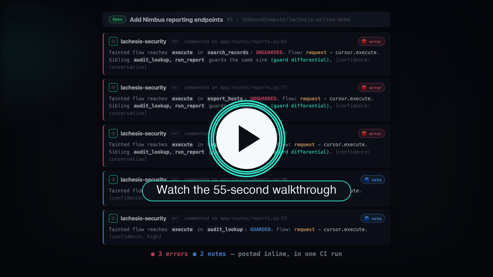

<!-- mcp-name: io.github.UnboundCompute/lachesis -->

# Lachesis

**A compiler-precise code graph you can ask questions about: how data moves, who calls what, what reaches a sink. C, Python, and TypeScript, all in one graph.**

[](https://pypi.org/project/lachesis-cpg/)
[](https://pypi.org/project/lachesis-cpg/)
[](https://github.com/UnboundCompute/lachesis/actions/workflows/ci.yml)
[](./LICENSE)
[](https://modelcontextprotocol.io)
[](https://github.com/UnboundCompute/lachesis/pkgs/container/lachesis)
[](https://glama.ai/mcp/servers/UnboundCompute/lachesis)
[](https://github.com/UnboundCompute/lachesis-action)

A symbol index (LSP, ctags, SCIP) tells you *where a name appears*. Lachesis tells you
*how a value moves* — does this request parameter reach that SQL call, which of these two
near-identical functions checks its input first, what can flow into this buffer. It parses
a codebase with real compilers, not regexes, builds one graph with a full dataflow layer
(value-flow, points-to, taint, aliasing), and answers questions from that graph — on the
command line, as a Python library, or over MCP to an AI agent.

[](https://github.com/UnboundCompute/lachesis-action-demo/pull/5)

A 55-second walkthrough: a Flask control plane where three handlers reach the same SQL sink
unguarded while two siblings authorize first. Lachesis follows the value, flags the three,
and names their guarded twins — [**see it live on the pull request →**](https://github.com/UnboundCompute/lachesis-action-demo/pull/5). Scan your own repo on every PR with the
[Lachesis Security Scan Action](https://github.com/UnboundCompute/lachesis-action).

## Quickstart

Install, then point it at a repo. One command builds and caches the graph and prints the
**leads** — the reachable sensitive operations that no guard covers, each a question to
investigate, not a verdict:

```bash
python -m pip install lachesis-cpg
lachesis scan ./my-project
```

```
  ✓ compiling (0.7s)
  2,677 nodes, 4,539 edges from typescript-compiler-api
  ✓ finding entrypoints that reach sensitive effects (0.1s)

2 candidate(s) from 1/1 entrypoint(s): 0 suppressed, 2 queued
  1. [0.810] handleWebhook (http/webhook.ts:10, route) -> findById(documentId) [database]
     prove or kill: a caller that passes no recognized guard can read or write data
     through findById(documentId) starting from handleWebhook at http/webhook.ts:10
  2. [0.810] handleWebhook (http/webhook.ts:10, route) -> findById(invoiceId) [database]
     unknown: this function branches on something; an owner/tenant comparison would not
     be recognized as a guard by name and is not modeled here
```

That second lead is the point: `handleWebhook` reaches two near-identical database calls,
and Lachesis tells them apart by *following the value*, not by matching a name. To hand the
same codebase to an agent that can chase these down, serve it over MCP:

```bash
lachesis mcp ./my-project        # zero-config: the agent builds and queries the graph itself
```

The first run of a project is slow; graphs are cached under `~/.lachesis/cache` and every
run after is fast.

## Three ways in: CLI, library, MCP

The same capability set is a command, a Python method, and an MCP tool — no surface is a
second-class citizen, and none makes you hand-write a graph-loading script.

**CLI** — one `lachesis` entrypoint. `scan` is the front door; when you want to name a
graph and drive it yourself, the verbs mirror the three build passes:

```bash
lachesis build   ./my-project graph.kuzu     # pass 1 — the structural graph
lachesis enrich  graph.kuzu                   # pass 2 — warm the dataflow + catalog sidecars
lachesis analyze graph.kuzu --summary         # pass 3 — the leads, rolled up by bug shape
lachesis explain graph.kuzu tree.c:1487       # one call: the whole evidence chain for a site
```

Pass 1 is bounded by default for core-only builds: each frontend shard streams directly
into Kùzu instead of composing the complete graph in Python, and the binary Pass-2 and
Pass-3 sidecars are emitted beside the store:

```bash
lachesis build ./my-project graph.kuzu --prune --timeout 3600
```

The core-only build also avoids token/proof compiler passes whose output is removed by
`--prune`. The complete Pass-2 input, compact translation facts, and Pass-3 substrate
are persisted as protobuf sidecars, so `lachesis enrich graph.kuzu` consumes the same
Pass-1 output without rebuilding the frontends. The optional `--stream-shards DIR`
form remains available when the intermediate shard directory must be retained.
Independent frontend subprocesses are run concurrently during the streaming build;
their shard sets are then projected together by Rust, preserving cross-language edges
without reconstructing a graph-sized Python object. On the reference full-core libxml2
build, the current cold baseline is 38.03 seconds and approximately 1.0 GiB peak RSS
(C/C++, Python, and TypeScript/JavaScript; no swap). The Rust publisher writes
`<store>.pass2.input.pb`, `<store>.pass2.facts.pb`, and `<store>.pass3.substrate.pb`.
When the native binary inputs are present, `enrich` hands their paths directly to
the Rust Pass-2 engine and retains only its compact event sidecar; it does not
rebuild the whole Pass-1 graph as Python objects. Older stores without these
sidecars use the compatibility path.

**Library** — a warm session: open (or build) once, ask many times, nothing recomputed
between questions.

```python
import lachesis

a = lachesis.Analysis.build("./my-project", "graph.kuzu", enrich=True)
leads = a.analyze(hard_stop=120)               # bounded pass 3 → a LeadSet held in memory
print(leads.summary())                         # {'total': ..., 'by_pattern': {...}, 'timed_out': False}

for lead in leads.near("tree.c", (1480, 1500)):   # filter the held leads, no recompute
    print(lead["pattern"], lead["entry"], lead["line"])

print(a.explain_sink("tree.c", 1487))          # the whole evidence chain for one site
```

`analyze` returns a `LeadSet` with `.summary()`, `.by_pattern()`, `.by_function()`,
`.near()` / `.at()`, `.to_json()`, and iteration — the leads stay in the session, so a
follow-up question is a filter, not a second pass. Bounded by default: with no `hard_stop`
it still caps its own wall clock and returns partial, flagged leads rather than hanging.
Runnable one-file scripts for each operation are in [`examples/`](./examples/README.md).

**MCP** — every verb above is also a tool an agent drives directly (`build_graph`,
`enrich`, `flow_pass`, `explain`, and the in-memory `leads_*` queries) over the same warm
session. See [MCP](#mcp).

## What you can ask

Once a graph is built, these are the moves — from the command line, the `Analysis` library,
or as MCP tools an agent drives directly:

| You want to know | The move |
|---|---|
| What is this subsystem built around? | `hubs`, the highest-degree functions (no name knowledge needed) |
| Where is this symbol? | `search` |
| Who calls this? What does it call? | `callers`, `callees` (direct and indirect dispatch) |
| Show me the actual source | `read_body`, exact bytes by offset |
| What's in this file or folder? | `open_file`, `open_folder` |
| Where does this value go? What feeds this sink? | `flow`, `sources_of` |
| Does this source reach that sink? | `reaches`, a labeled witness path or an honest "no" |
| What does this pointer point to? What aliases it? | `points_to`, `aliases` |
| Where does untrusted input reach a dangerous sink? | `taint`, source→sink witnesses folded from the Atropos catalog onto this graph's nodes |
| Which entrypoints reach sensitive effects without a recognized guard? | `scan`, the leads with census/frontier counts (questions, not verdicts) |
| What are the leads, and where do they land? | `analyze` / `leads_summary` / `leads_at`, held warm and filtered by pattern, function, or `file:line` |
| The full evidence for one site, in one call | `explain`, chaining census → candidate → provenance → guard → source |

Every answer carries a confidence and an origin. An `exact` edge is resolved; a
`conservative` one is a deliberate over-approximation the tool tells you about rather than
hiding. You read the results as evidence, not as verdicts.

## MCP

Use `lachesis mcp` from the same environment that built the graph. You can hand it an
absolute `graph.kuzu` path, but you don't have to: start it with no argument and the agent
builds its own graph on demand with `build_graph` — point it at a repo and it compiles,
caches, and attaches in one call (an unchanged tree is served from cache; `refresh: true`
forces a rebuild). Overlapping requests are serialized around the single store, so a
concurrent call can't tear the server down mid-flight.

**One click** (uses `uvx`, no install step):

[](https://cursor.com/install-mcp?name=lachesis&config=eyJjb21tYW5kIjoidXZ4IiwiYXJncyI6WyItLWZyb20iLCJsYWNoZXNpcy1jcGciLCJsYWNoZXNpcyIsIm1jcCJdfQ==)
&nbsp;
[](https://insiders.vscode.dev/redirect/mcp/install?name=lachesis&config=%7B%22command%22%3A%22uvx%22%2C%22args%22%3A%5B%22--from%22%2C%22lachesis-cpg%22%2C%22lachesis%22%2C%22mcp%22%5D%7D)

Or configure any client by hand — drop one of these into your MCP client's config
(Claude Desktop, Cursor, Claude Code). If the package is already installed:

```json
{
  "mcpServers": {
    "lachesis": { "command": "lachesis", "args": ["mcp"] }
  }
}
```

Or with no install step, letting `uvx` fetch it on first run:

```json
{
  "mcpServers": {
    "lachesis": { "command": "uvx", "args": ["--from", "lachesis-cpg", "lachesis", "mcp"] }
  }
}
```

Or as a container — no Python, Node, or clang on the host, all three frontends in the image:

```json
{
  "mcpServers": {
    "lachesis": {
      "command": "docker",
      "args": ["run", "--rm", "-i", "-v", "/path/to/your/project:/src",
               "ghcr.io/unboundcompute/lachesis:edge"]
    }
  }
}
```

Mount your project (here `/src`) and point `build_graph` at it. In VS Code use
`${workspaceFolder}` for the mount source. The image is published for linux/amd64 and
linux/arm64; `:edge` tracks `main`, and each release also publishes an `:x.y.z` tag.
More client and troubleshooting notes are in
[`docs/queries.md`](./docs/queries.md#the-lachesis-mcp-server).

## Languages

Three frontends, each backed by a real compiler or the language's own parser, never a
heuristic grammar.

| Language | Engine | Extensions |
|---|---|---|
| TypeScript / JavaScript | the TypeScript compiler API, with the type checker | `.ts` `.tsx` `.mts` `.cts` `.js` `.jsx` |
| Python | CPython's own `ast` + `symtable` (standard library only) | `.py` `.pyi` |
| C | Clang, via its AST dump | `.c` `.h` |

A mixed tree is **one graph, not three**. Lachesis picks a frontend per file, composes the
results into a single node and edge set, and runs the same analysis over all of it — a
Python caller and a TypeScript callee sit in the same store and the same tools answer over
both.

Two honest limits, stated up front: Python has no type checker, so it resolves attribute
calls lexically and says so (`types: none`); C reads one translation unit at a time, so it
won't follow a call through a function-pointer table it never sees. Each frontend declares
what it actually knows, and a validator holds it to that claim.

## How it's built

Lachesis works in three passes, and each is a verb.

**Pass 1 — `build`** parses the source with real compilers into the *core tier*: syntax,
symbols, and calls. This is the fast part, and all most navigation needs.

**Pass 2 — `enrich`** materializes the *dataflow tier* — value-flow, points-to, taint,
aliasing — a pure function of the core graph, so it is never written at build time. You
rarely run it by hand: any query that needs value-flow folds in just the *cone* around its
seed and caches it beside the store, so nothing pays for a whole-graph pass it never asked
about. `enrich` is the one-shot "warm it all now" for a batch job, persisting the tier and
catalog bind as `.dataflow.pb` / `.bind.pb` sidecars so a later, fresh process opens warm.

**Pass 3 — `analyze`** runs the flow pass over the enriched graph and produces the leads:
safety-obligation sites, scored and matched against bug shapes. It is **bounded** — a
`hard_stop` budget caps the wall clock and returns partial leads with `timed_out=True`
rather than hanging, so a large graph can't stall a call. An empty result over a partial
run reads as *not evaluated*, never *clean*.

```
  source tree
      |
      v  build  (pass 1)
  frontends        real compilers parse each language into
      |            syntax, symbols, calls  (the core tier)
      v  enrich (pass 2, on demand or all-at-once)
  kuzu store       staged Parquet, bulk-copied into an embedded
      |            columnar graph DB; dataflow tier folded in as a
      |            cone around each seed, cached beside the store
      v  analyze (pass 3, bounded)
  nav  (+ MCP)     hubs, search, callers/callees, read_body, flow,
                   reaches, sources_of, points_to, aliases, scan,
                   explain, leads — over one warm session
```

`graph.kuzu` is a directory: the embedded database plus a manifest. That *is* the graph.
Every tool reads it directly, and `lachesis mcp` serves the same tools over stdio for any
MCP-capable client. Large-build, monorepo, and CI tuning — including cold-build memory and
timing on a full libxml2 graph — live in [`docs/scaling.md`](./docs/scaling.md); the graph
model is in [`docs/graph-model.md`](./docs/graph-model.md).

## Install

```bash
python -m pip install lachesis-cpg
```

The release-tested Python window is 3.10–3.12 (the CI matrix). Python analysis needs
nothing beyond the package; TypeScript/JavaScript builds need `node` on `PATH` and C
builds need `clang` — a missing one comes back as an actionable error, not a crash.

To work from a clone (the contributor workflow, and how you build the TypeScript frontend
from checked-out sources):

```bash
git clone https://github.com/UnboundCompute/lachesis && cd lachesis
python -m pip install --upgrade pip     # editable installs need pip >= 21.3
python -m pip install -e ".[dev]"       # builder, nav, MCP server, tests
npm ci                                   # install the locked TypeScript compiler dependency
cargo build --release --manifest-path native/clang_frontend/Cargo.toml
```

Runtime dependencies are just `kuzu` and `pyarrow`; everything else is standard library.
Node 20+ must be on your PATH for the TS frontend. In a source checkout, the C frontend
automatically uses the release Rust binary above; without that binary it uses the
portable Clang frontend. Run the frontend parity gate CI uses with `make check`.
Semantic `concept_search` is optional and separate — opt in with
`pip install -e ".[concept-search]"`, then `lachesis concept-model download`.

## Where to go next

- **[`examples/`](./examples/README.md)**: a five-minute walkthrough on a bundled fixture, plus one runnable `.py` script per library operation.
- **[`docs/graph-model.md`](./docs/graph-model.md)**: what's in the graph — node kinds, edge kinds, and tiers.
- **[`docs/queries.md`](./docs/queries.md)**: every way to ask a question, both `lachesis query` and the MCP tools.
- **[`docs/scaling.md`](./docs/scaling.md)**: large-build, monorepo, and CI-runner tuning; managing the local graph cache.

## Roadmap

Recently shipped:

- [x] **One reader, three front doors.** The `lachesis.Analysis` library class is the single implementation; a `lachesis <verb>` subcommand and an MCP tool sit over each method — no hand-written graph-loading script on any surface.
- [x] **Bounded analysis.** Pass 3 takes a `hard_stop` budget and returns partial, flagged leads instead of hanging; the census a graph pays for once is cached as a sidecar so the next process opens warm.
- [x] **Zero-config MCP.** `lachesis mcp` starts with no graph path; `build_graph` compiles, caches, and attaches on demand, and overlapping requests are serialized around the store.

Near-term, roughly in order:

- [ ] **A smaller front door.** One default command (`lachesis <path>`), one result noun everywhere, and a five-name library API — a surface simplification so the first command and the first import are obvious.
- [ ] **Monorepo-scale builds.** `--parallel-packages` compiles each package on its own so very large TypeScript trees don't exceed the compiler's internal limits; making that the smooth default is active work.
- [ ] **Bounded security signal.** Reworking the guard-analysis tools to fold the same per-seed, on-demand cone the dataflow tools already use, so they run on a large graph without a whole-graph pass.
- [ ] **The reachability query, first-class.** "Can attacker input reach this sink" as a single call returning a witness path or a bounded no, across file, package, and language boundaries.

## Status

Lachesis is early and moving fast. The graph model, the store, and the navigation and MCP
layer work today and are held to a parity test suite that checks the columnar store answers
every tool identically to the same graph held whole in memory. The schema and tool set may
still shift before 1.0; the [`CHANGELOG`](./CHANGELOG.md) calls out changes explicitly.

## License

AGPL-3.0. See [`LICENSE`](./LICENSE). You're free to use, study, modify, and share it,
commercially included; run a modified version as a network service and you make your
modified source available to its users. If that doesn't fit — say, embedding in a closed
product — a separate commercial license may be available. See
[`CONTRIBUTING.md`](./CONTRIBUTING.md) or open an issue.

## Security

Found a vulnerability? Please don't open a public issue; see [`SECURITY.md`](./SECURITY.md)
for private reporting.
